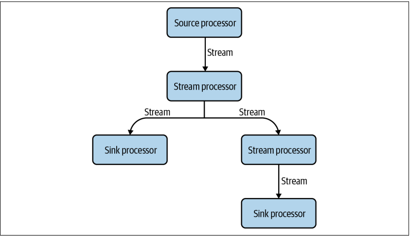
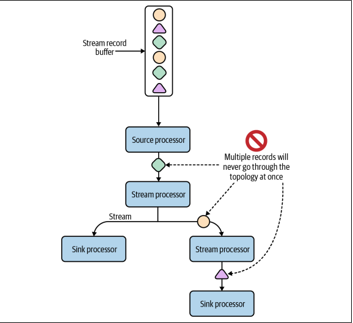

#Kafka Streams

Mastering Kafka streams and ksqlDB is a great read in this folder I'll be documenting some of the keynotes from that book and possibly other resources

> Kafka streams leverages a programming paradigm called data flow programming

* in a [DataFLow]("https://en.wikipedia.org/wiki/Dataflow_programming") architecture the program is modeled as a directed graph and it generally shares some functional programming features
* Processing units acts as a stateless black box whenever the data is available it's then processed
* That's why dataflow languages are inherently parallel and can work well in large, decentralized systems
* Kafka Streams application is structured as a directed acyclic graph

* Kafka Streams uses a depth-first strategy when processing data.

### Terminologies
***Source processors***
>Sources are where information flows into the Kafka Streams application. Data is
read from a Kafka topic and sent to one or more stream processors.

***Stream processors***
> applying data processing/transformation logic on the input stream.Some example  operators are filter, map, flatMap, and join .

***Sink processors***
>Sinks are where enriched, transformed, filtered, or otherwise processed records
are written back to Kafka, either to be handled by another stream processing
application or to be sent to a downstream data store via something like Kafka
Connect. Like source processors, sink processors are connected to a Kafka topic. 

***TASKS***
>the smallest unit of work that can be performed in parallel in a Kafka Streams
application
> 
> Slightly simplified, the maximum parallelism at which your application may run is
bounded by the maximum number of stream tasks, which itself is determined by the
maximum number of partitions of the input topic(s) the application is reading from —Andy Bryant

***Threads***
> are what excutes the tasks when they are instantiated

#Key takeaways

* Multiple records will never go through the same topology at once
> When multiple sub-topologies are in play, the single-event rule
does not apply to the entire topology, but to each sub-topology.
* When we define a topology in Kafka Streams, we are not actually executing the program. Instead, we are building a template for how data should flow through our application.
> This template (our topology) can be instantiated multiple times in a single application instance, and parallelized across many tasks and stream threads
